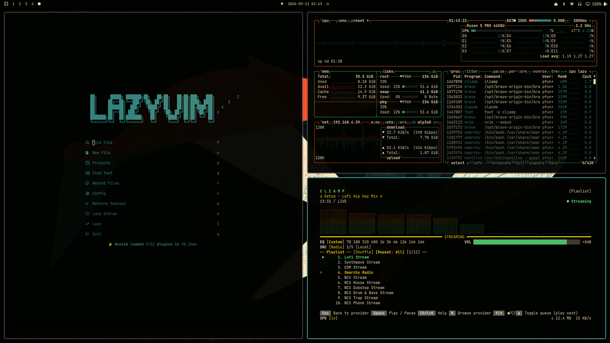

# Whale Watching

A dark, deep-sea [Omarchy](https://omarchy.org/) theme — teal and cyan ocean
tones with warm sunset-orange accents.



## Install

```bash
omarchy theme install https://github.com/pfunderdome/omarchy-whale-watching-theme.git
```

Or clone it manually into `~/.config/omarchy/themes/`:

```bash
git clone https://github.com/pfunderdome/omarchy-whale-watching-theme.git \
  ~/.config/omarchy/themes/whale-watching
omarchy theme set "Whale Watching"
```

## What's included

- `colors.toml` — the full color palette (dark mode, teal accent `#378982`)
- `backgrounds/` — 4 whale-watching wallpapers, cycle with `omarchy theme bg next`
- `icons.theme` — Yaru-prussiangreen icon set
- `preview.png` — desktop preview shown in the theme switcher
- `unlock.png` / `preview-unlock.png` — the lock screen wordmark and its preview

## Credits

Palette generated with Aether for Omarchy v4.
